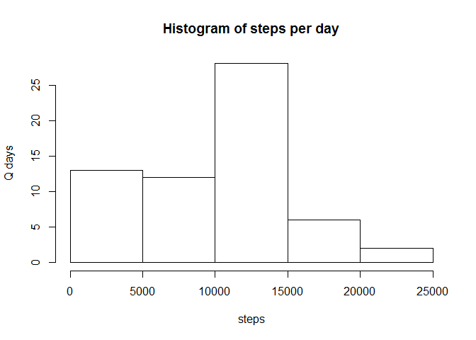

# Reproducible Research: Peer Assessment 1


## Loading and preprocessing the data

```r
library(knitr)
```

```
## Warning: package 'knitr' was built under R version 3.2.2
```

```r
library(ggplot2)
df <- read.csv("activity.csv")
```

## What is mean total number of steps taken per day?
The total number of steps taken per day:

```r
r1 <- as.data.frame(tapply(df$steps, df$date, sum, na.rm=TRUE))
r1 <- cbind(date = rownames(r1),r1) 
colnames(r1) <- c("date", "steps")
```

Histogram of steps taken per day

```r
hist(r1$steps, main="Histogram of steps per day", xlab="steps", ylab="Q days")
```

 

Mean of total number of steps taken per day

```r
mean(r1$steps)
```

```
## [1] 9354.23
```

Median of total number of steps taken per day

```r
median(r1$steps)
```

```
## [1] 10395
```


## What is the average daily activity pattern?
Time series plot of the 5-minute interval (x-axis) and the average number of steps taken (y-axis)

```r
r2 <- as.data.frame(tapply(df$steps, df$interval, mean, na.rm=TRUE))
r2 <- cbind(interval = rownames(r2),r2) 
colnames(r2) <- c("interval", "steps")
ggplot(r2, aes(x=interval, y=steps, group=1)) + geom_line() + xlab("5-minute interval") + ylab("Avg number of steps taken")
```

 

5-minute interval  with the maximun number of steps 

```r
r2[r2$steps == max(r2$steps),][1]
```

```
##     interval
## 835      835
```


## Imputing missing values
Total number of missing values in the dataset

```r
sum(is.na(df$steps))
```

```
## [1] 2304
```

Filling the missing values with mean

```r
df1 <- df
df1$steps[is.na(df1$steps)] = mean(df[df$date==df1$date,]$steps, na.rm=TRUE)
```

The total number of steps taken per day:

```r
r3<- as.data.frame(tapply(df1$steps, df1$date, sum, na.rm=TRUE))
r3 <- cbind(date = rownames(r3),r3) 
colnames(r3) <- c("date", "steps")
```

Histogram of steps taken per day

```r
hist(r3$steps, main="Histogram of steps per day", xlab="steps", ylab="Q days")
```

 

Mean of total number of steps taken per day

```r
mean(r3$steps)
```

```
## [1] 10766.19
```

Median of total number of steps taken per day

```r
median(r3$steps)
```

```
## [1] 10766.19
```

These values differ from the first estimates. 
Imputting missing data makes mean and median similar and big numbers than first calculated.

## Are there differences in activity patterns between weekdays and weekends?
Create a new factor variable in the dataset with two levels – “weekday” and “weekend” 

```r
df1$weekday <- ifelse(as.POSIXlt(as.Date(df1$date))$wday %in% c(1,2,3,4,5), "weekday", "weekend")
```

Panel plot containing a time series plot of the 5-minute interval (x-axis) and the average number of steps taken, 
averaged across all weekday days or weekend days (y-axis).

```r
ggplot(df1, aes(x=interval, y=steps, group = 1)) + xlab("5-minute interval") + ylab("Avg") + facet_grid(weekday ~ .) + stat_summary(fun.y="mean", geom="line")
```

 

